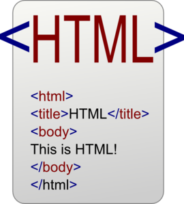

# ¿Qué es y cómo funciona HTML?

El HTML es el HyperText Markup Language y es el lenguaje estándar que se utiliza para estructurar las páginas web, ya que nos permite darle un esqueleto a nuestros sitios y organizar nuestra información de la manera adecuada.

## 

---

Empezaremos con algunos elementos base para poder trabajar en HTML, comenzando por los headings, los párrafos, los links, las imágenes, las tablas y las listas, estos 6 elementos nos ayudaran a estructurar un archivo de HTML, para después mostrarlo en una página. Pero antes de comenzar con lo bueno de programación, definamos como funciona, para que es y de donde surge el HTML con un poco de historia, para entender para que necesitásemos aprender HTML si queremos ser desarrolladores Frontend.

HTML significa “HyperText Markup Language”, es un lenguaje de hipertexto para poder hacer estructuras de páginas y es el lenguaje estándar que utilizan todos los navegadores para interpretar la estructura de tu página, permitiéndole leer y saber los elementos que contiene, su posición, e incluso tu posicionamiento dentro de los buscadores, lo cuál esta estrictamente relacionado con la optimización de motores de búsqueda (SEO) para que la información de tu sitio este bien posicionada dentro de internet, y las personas la encuentren con mayor facilidad, puesto que nos permite darle un esqueleto a nuestros sitios y organizar nuestra información de la manera adecuada, conforme vayamos avanzando en la misión puntualizaremos más en ello.

HTML existe desde hace un poco más de 20 años, el mismo tiempo de funcionamiento de los navegadores, conforme pasan los años este lenguaje ha ido evolucionando y actualmente nos encontramos en la versión HTML 5, que justamente será con la que trabajaremos a continuación. Esta versión es soportada por la gran mayoría de los navegadores, a excepción a veces de Internet Explorer que le cuesta interpretar el lenguaje, sin embargo, Chrome, Safari, Firefox, Opera, Brave, etc, logran interpretar de manera correcta HTML. No olviden que en la primera semana les deje una herramienta que les permite revisar si la tecnología que están usando se visualiza de forma correcta en los navegadores existentes.

## Estructura HTML

De forma general podemos ver que todas las palabras tienen dos corchetes <>, uno al inicio y otro al final, uno que abre y otro que cierra con una diagonal antes de la palabra, lo cual es parte de la sintaxis, a esto se le conoce como “etiquetas”, las cuáles se encargan de delimitar cada cuando se está poniendo un inicio y un final de cierto elemento en HTML, la posición de cada elemento en html se rige por estas etiquetas.

Se refiere al tipo de documento, se encarga de que el navegador pueda interpretar y leer que el contenido es un archivo de HTML. Nos define nuestra estructura raíz que indica que dentro de ese html tenemos el contenido, todo lo que este fuera de ello no será interpretado por nuestro navegador. Lang se refiere al languaje, que significa lenguaje y se refiere al idioma en el que va a estar nuestra página. Por lo general, se mantiene en inglés, porque para html usaremos distintos caracteres en inglés, sin embargo, puede cambiarse a cualquier otro idioma.

Por ejemplo, para trabajar en español se utiliza el cual también tiene sus variaciones ya sea español de España, Latinoamericano, etc, pero también aplica para cualquier otro idioma Frances, portugués, Japonés etc. Cambiar el idioma va a influir directamente en el SEO “Search Engine Optimization” (Optimización de motores de búsqueda), puesto que si nosotros estamos buscando las cosas en español, probablemente nos aparezca que el esta en español, el saber esto es de suma importancia por si quisiéramos llegar a un usuario objetivo.

Es lo primero que lee el navegador, e incluye metadatos, los cuáles son muy valiosos en cuanto a cookies, scripts, tracking de usuarios, entre otras opciones. Se encarga de los metadatos (datos de los datos) nos sirven para poder configurar nuestro archivo de html, y en específico aquí para indicar que set de caracteres usaremos en la página dependiendo del teclado que se use, el UTF-8 funciona con inglés y español pero si estuviéramos programando en una página en otro idioma que tuviera ciertos caracteres especiales y diferentes, tendríamos que cambiar el UTF-8 por el correspondiente.

```html
<meta http-equiv="“X-UA-Compatible”" content="“IE" ="edge”" />
```

Indica el contenido tiene que ser equivalente de Internet Explorer.

```html
<meta
  name="“viewport”"
  content="“width"
  ="device-width,"
  initial-scale="1.0”"
/>
```

Se refiera a la vista general de nuestro sitio, como va a estar desplegado por defecto, el cual contiene un ancho de la muestra del sitio igual que el ancho de nuestro dispositivo, con un “inicial-scale=1.0 que sirve para el zoom o zoom out, dependiendo de cómo es que nosotros queramos nuestra página.

```html
<title>Titulo</title>
```

Es el título de nuestro sitio en el head.

```html
<style></style>
```

Son etiquetas de estilos nos permite importar archivos de otro tipo como por ejemplo de Javascript, CSS, etc.
Al ingresar a una página el navegador descarga la página de internet y se lo muestra al cliente. Se descargan los estilos, funcionalidades, etc. Este orden es importante para que la página se visualice de forma ordenada.

Finalmente tenemos lo siguiente:

Es el cuerpo de nuestra página, donde podemos poner las diferentes etiquetas y elementos de HTML que nosotros queramos utilizar para que la página esté funcionando de forma correcta.
En la siguiente lección veremos el contenido dentro del como lo son los headings los párrafos, los links, las imágenes, etc. ¡Vámonos de aquí hasta el espacio Explorer! Te veo en la siguiente lección.

- **_¡Vámonos hasta el espacio y más allá Explorers!_**
